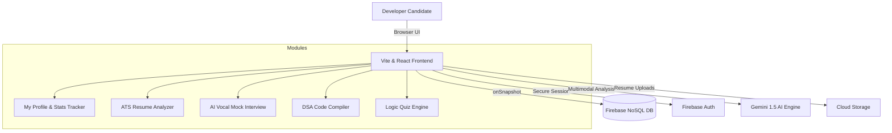

# <p align="center">🎯 InterviewAce AI</p>

<p align="center">
  <strong>The Ultimate AI-Powered Candidate Preparation Platform</strong>
</p>

<p align="center">
  <a href="https://react.dev/"></a>
  <a href="https://vitejs.dev/"></a>
  <a href="https://tailwindcss.com/"></a>
  <a href="https://firebase.google.com/"></a>
  <a href="https://deepmind.google/technologies/gemini/"></a>
</p>

<p align="center">
  InterviewAce AI is an advanced, production-ready candidate simulation platform that helps developers and engineers bridge skills gaps to land their target technical roles. Powered by <strong>Google Gemini 1.5 Pro AI</strong> and a real-time <strong>Firebase Serverless Architecture</strong>, it delivers high-fidelity mock interviews, deep resume ATS auditing, real-time code compiling, and logic aptitude tests inside a premium <strong>tactile neomorphic interface</strong>.
</p>

---

## 🚀 Key Modules & Capabilities

### 📄 AI Resume Analyzer & ATS Optimizer

- **ATS Score Engine:** Compares resume textual content against target job roles to calculate matching percentages.
- **Semantic Analysis:** Highlights keywords, technical stack elements, and soft skill matches.
- **Actionable Issue Audits:** Identifies issues (formatting issues, poor action verbs, lack of metrics) with targeted correction guides.
- **3-Month Growth Timeline:** Instantly compiles a week-by-week personalized learning roadmap to bridge gaps.

### 🎙️ AI Mock Interview Simulator

- **Interactive AI Coach:** Configures and conducts interviews utilizing text or voice.
- **Contextual Questions:** Dynamically tailors behavioral and technical interview questions based on the candidate's target role.
- **Scoring & Exemplary Model Answers:** Evaluates response technical depth, vocabulary, and communication, suggesting ideal model answers.

### 💻 Coding DSA Workspace

- **In-Browser IDE:** Code sandbox supporting code suggestions, custom test inputs, and syntax highlighting.
- **Multi-Language Compiler Simulation:** Run, compile, and validate algorithms against test inputs in **JavaScript, Python, C++, and Java**.
- **AI Solution Assistance:** Request context-aware hints, edge case analysis, and Big-O complexity reports.

### 🧠 Logic Aptitude Testing Arena

- **Neomorphic Configuration:** Configure test topics (Quantitative, Probability, Engineering Logic) and question volumes.
- **Simulated Exams:** Real-time timer constraints, interactive score sheets, and correct-choice explanation sheets.

### 📊 Gamified Developer Progress Board

- **Tactile Stats Dashboard:** Visualizes overall metrics including Streak Days, Solved Challenges, Quizzes Taken, and Mock Interviews.
- **Recharts Activity Graph:** Beautiful neomorphic `AreaChart` mapping daily study minutes over the last 7 days.
- **Real-time Leaderboard:** Sorts users globally based on calculated XP.
- **Public Sharing Links:** Generate public, read-only profile URLs to share progress with peers and recruiters.

### 🔔 Real-Time Notification Stream

- Instant popover and in-page notification updates powered by Firestore `onSnapshot` subscriptions.

---

## 🏗️ Technical Highlights & Optimization

### 🔗 Real-Time Backend Syncing

- Uses **Firestore Snapshot Subscriptions** (`onSnapshot`) to implement reactive state syncing. When a user completes an activity, background statistics (`syncUserStats`) re-evaluate immediately to award XP and unlock badges, reflecting in real-time across the navbar, sidebar, and leaderboard.

### ⚡ Batch Commit Optimization

- Utilizes **Firestore Write Batches** (`writeBatch`) when marking multiple notifications as read. This merges multi-document mutations into a single network call to prevent layout thrashing.

### 🧠 Gemini Prompt Engineering

- Leverages advanced JSON Schema structured outputs from Gemini 1.5 Pro models. Prompts enforce strict type boundaries, ensuring consistent schema responses for ATS metrics and mock interview evaluations.

### 🎨 Design Tokens & Theming (Neomorphism)

- Designed using modern neomorphic CSS variables (`index.css`):
  - **Shadow Outset:** `8px 8px 16px #D4CFC8, -8px -8px 16px #FFFFFF`
  - **Shadow Inset:** `inset 4px 4px 8px #D4CFC8, inset -4px -4px 8px #FFFFFF`
  - **Palette:** Sage Green (`#8FAF8F`), Sky Blue (`#A8C5DA`), Blush Pink (`#F0B8C8`), and warm cream backdrops (`#F5EFE6`).

---

## 📂 Project Architecture



---

## 💾 Database Schema (Cloud Firestore)

Below are the JavaScript object schemas representing document structures in our Firestore database collection:

### `users` Collection Document Structure

```javascript
{
  name: "Jane Doe",
  email: "jane.doe@example.com",
  college: "Tech University",
  xp: 1250,
  level: 4,
  badges: ["code_warrior", "quiz_master"], // Array of badge IDs
  streak: 5,
  testsTaken: 8,
  problemsSolved: 12,
  interviewsDone: 3
}
```

### `results` Collection Document Structure

```javascript
{
  userId: "user_document_id_xyz",
  topic: "Quantitative Analysis",
  difficulty: "medium",
  score: 85, // Score percentage
  questions: [
    {
      question: "Solve for x: 2x + 5 = 15",
      selectedAnswer: "5",
      correctAnswer: "5",
      isCorrect: true
    }
  ],
  createdAt: "2026-06-29T12:00:00Z" // ISO string or Firestore Timestamp
}
```

### `interviewSessions` Collection Document Structure

```javascript
{
  userId: "user_document_id_xyz",
  role: "Frontend Engineer",
  difficulty: "hard",
  overallScore: 78,
  completedAt: "2026-06-29T14:30:00Z", // ISO string or Firestore Timestamp
  evaluations: [
    {
      question: "Explain closures in JavaScript.",
      answer: "A closure is a function that remembers its outer variables...",
      score: 85,
      feedback: "Great explanation of lexical scoping.",
      idealAnswer: "A closure is the combination of a function bundled together..."
    }
  ]
}
```

---

## 🚀 Getting Started

### 📋 Prerequisites

- **Node.js:** v18.0.0+
- **Firebase:** Account with Firestore and Auth enabled
- **Google AI Studio:** Gemini API Key

### 💻 Installation

1. **Clone the repository:**

   ```bash
   git clone https://github.com/your-username/interviewace-ai.git
   cd interviewace-ai
   ```

2. **Install dependencies:**

   ```bash
   npm install
   ```

3. **Configure Environment Variables:**
   Create a `.env` file at the root:

   ```env
   VITE_FIREBASE_API_KEY=your_api_key
   VITE_FIREBASE_AUTH_DOMAIN=your_auth_domain
   VITE_FIREBASE_PROJECT_ID=your_project_id
   VITE_FIREBASE_STORAGE_BUCKET=your_storage_bucket
   VITE_FIREBASE_MESSAGING_SENDER_ID=your_sender_id
   VITE_FIREBASE_APP_ID=your_app_id
   VITE_GEMINI_API_KEY=your_gemini_api_key
   ```

4. **Start local development server:**

   ```bash
   npm run dev
   ```

   Open `http://localhost:5173` in your browser.

5. **Build project for deployment:**
   ```bash
   npm run build
   ```

---

## 📜 License

Distributed under the MIT License. See `LICENSE` for details.

---

_Formulated by Avinash Chavda — Created to optimize interview preparation and profile analytics._
