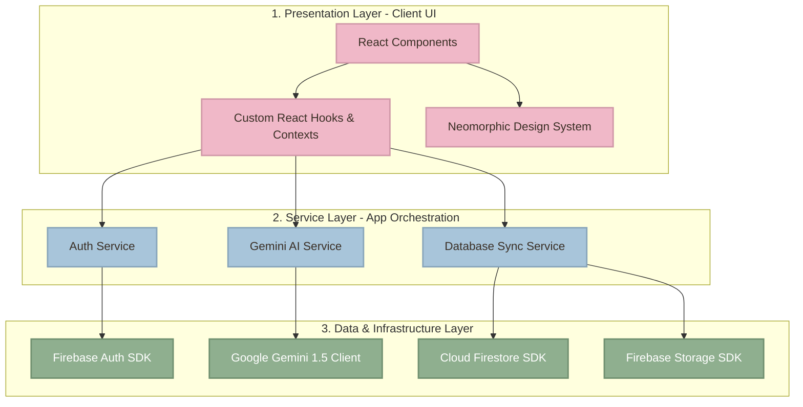
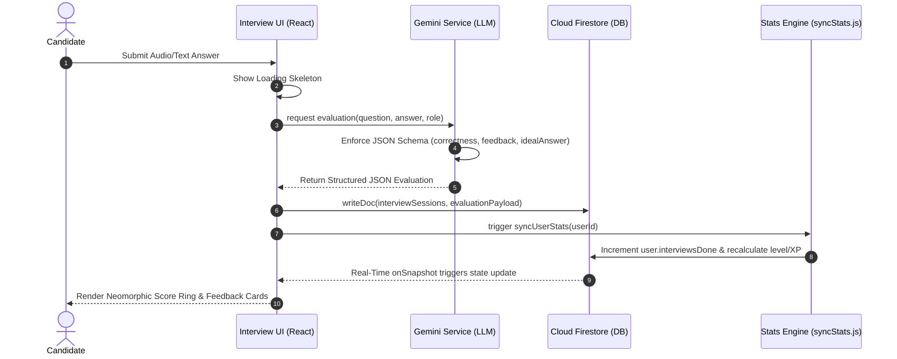

# <p align="center">🎯 InterviewAce AI</p>

<p align="center">
  <strong>Enterprise-Grade Candidate Preparation & AI-Driven Assessment Platform</strong>
</p>

<p align="center">
  <a href="https://react.dev/"></a>
  <a href="https://vitejs.dev/"></a>
  <a href="https://tailwindcss.com/"></a>
  <a href="https://firebase.google.com/"></a>
  <a href="https://deepmind.google/technologies/gemini/"></a>
  <a href="https://interview-ace-ai-jet.vercel.app"></a>
</p>

---

## 📺 Video Demo & Live Link

- 🚀 **Live Demo:** [Deploy Link (Vercel)](https://interview-ace-ai-jet.vercel.app)
- 📹 **Walkthrough Video:** Click below to view the application features in action.

<p align="center">
  <a href="YOUR_YOUTUBE_VIDEO_URL_HERE">
    
  </a>
</p>

---

## 📖 Product Overview

**InterviewAce AI** is a professional, product-driven candidate simulator that leverages generative AI to help developers land technical roles. The application is built using a **Layered Architecture (Clean Architecture)** design, decoupling the React Presentation UI from data storage and LLM services.

Through **real-time subscription flows** and structured **Google Gemini 1.5 Pro integrations**, the system automates resume ATS analysis, mock interviews, DSA challenge compilations, and logical assessments.

---

## 🏛️ System & Software Architecture

InterviewAce AI is built using a decoupled, layered software pattern to ensure high cohesion, low coupling, and scalable feature addition.

### Layered Architecture Diagram



---

## 🔄 Core Product Workflows

### 1. AI Mock Interview Evaluation Pipeline

The diagram below illustrates the lifecycle of a single mock interview session, from prompt compilation to real-time database persistence and state rendering.



### 2. Resume ATS & Roadmap Compilation Lifecycle

When a user uploads a resume, the system initiates a concurrent parsing and timeline-generation pipeline:

1. **Extraction:** Resume contents are converted to structural text and sent to `analyzeResume(resumeText)`.
2. **Analysis:** The LLM evaluates formatting anomalies, calculates matching percentages, and lists missing keywords.
3. **Timeline Compilation:** Simultaneously, a second prompt compiles a week-by-week study timeline to close identified skills gaps.
4. **Persistence:** The calculated roadmap, ATS score, and audit logs are written to Firestore as a single document under the `resumes` collection.

---

## 📂 Directory & Module Layout

```text
src/
├── components/
│   ├── auth/          # PrivateRoute, AdminRoute Guards
│   ├── layout/        # Sidebar, Navbar Layout wrappers
│   ├── ui/            # Reusable Neomorphic UI Kit (Button, Card, Modal)
│   └── gamification/  # XPBar, LevelBadge Progression indicators
├── contexts/          # React Auth State Provider
├── hooks/             # Custom useAuth Hook Exports
├── pages/             # Pages by Domain (Aptitude, Mock-Interview, Profile, Settings)
├── services/          # Gemini AI API Integration Layer
├── store/             # Zustand Global State Management
└── utils/             # Database Synchronization Engines, Helpers, Mocks
```

---

## 🎨 Applied Design Patterns

- **Repository/Service Pattern:** All API calls and database actions are abstracted into standalone service modules (`geminiService.js`, `authService.js`), leaving React components UI-focused.
- **Observer Pattern (Reactive UI):** Components subscribe to Firestore document streams via `onSnapshot` listeners. State changes propagate automatically across layout widgets.
- **Command/Batch Pattern:** Rather than issuing individual network writes for bulk status updates (e.g. marking notifications read), changes are bundled into a `writeBatch` to limit API overhead.

---

## 💾 Database Schema (Cloud Firestore)

Below are the JavaScript object schemas representing document structures in our Firestore database collection:

### `users` Collection Document Structure

```javascript
{
  name: "Jane Doe",
  email: "jane.doe@example.com",
  college: "Tech University",
  xp: 1250,
  level: 4,
  badges: ["code_warrior", "quiz_master"], // Array of badge IDs
  streak: 5,
  testsTaken: 8,
  problemsSolved: 12,
  interviewsDone: 3
}
```

### `results` Collection Document Structure

```javascript
{
  userId: "user_document_id_xyz",
  topic: "Quantitative Analysis",
  difficulty: "medium",
  score: 85, // Score percentage
  questions: [
    {
      question: "Solve for x: 2x + 5 = 15",
      selectedAnswer: "5",
      correctAnswer: "5",
      isCorrect: true
    }
  ],
  createdAt: "2026-06-29T12:00:00Z" // ISO string or Firestore Timestamp
}
```

### `interviewSessions` Collection Document Structure

```javascript
{
  userId: "user_document_id_xyz",
  role: "Frontend Engineer",
  difficulty: "hard",
  overallScore: 78,
  completedAt: "2026-06-29T14:30:00Z", // ISO string or Firestore Timestamp
  evaluations: [
    {
      question: "Explain closures in JavaScript.",
      answer: "A closure is a function that remembers its outer variables...",
      score: 85,
      feedback: "Great explanation of lexical scoping.",
      idealAnswer: "A closure is the combination of a function bundled together..."
    }
  ]
}
```

---

## ⚡ Technical Implementations & Optimizations

- **Framer Motion Micro-Animations:** Dynamic state transitions use physical layouts (spring physics and exit animations) to optimize cognitive load.
- **Responsive Layout Guard:** Layouts use double-tier drawer views, automatically collapsing sidebars on smaller displays to protect screen space.
- **Structured Prompts:** Enforces JSON responses using system instructions to prevent LLM hallucination and ensure runtime parsing safety.

---

## 🚀 Getting Started

### 📋 Prerequisites

- **Node.js:** v18.0.0+
- **Firebase:** Account with Firestore and Auth enabled
- **Google AI Studio:** Gemini API Key

### 💻 Installation

1. **Clone the repository:**

   ```bash
   git clone https://github.com/your-username/interviewace-ai.git
   cd interviewace-ai
   ```

2. **Install dependencies:**

   ```bash
   npm install
   ```

3. **Configure Environment Variables:**
   Create a `.env` file at the root:

   ```env
   VITE_FIREBASE_API_KEY=your_api_key
   VITE_FIREBASE_AUTH_DOMAIN=your_auth_domain
   VITE_FIREBASE_PROJECT_ID=your_project_id
   VITE_FIREBASE_STORAGE_BUCKET=your_storage_bucket
   VITE_FIREBASE_MESSAGING_SENDER_ID=your_sender_id
   VITE_FIREBASE_APP_ID=your_app_id
   VITE_GEMINI_API_KEY=your_gemini_api_key
   ```

4. **Start local development server:**

   ```bash
   npm run dev
   ```

   Open `http://localhost:5173` in your browser.

5. **Build project for deployment:**
   ```bash
   npm run build
   ```

---

## 📜 License

Distributed under the MIT License. See `LICENSE` for details.

---

_Formulated by Avinash Chavda — Designed to empower candidates through structured AI-driven assessments._
